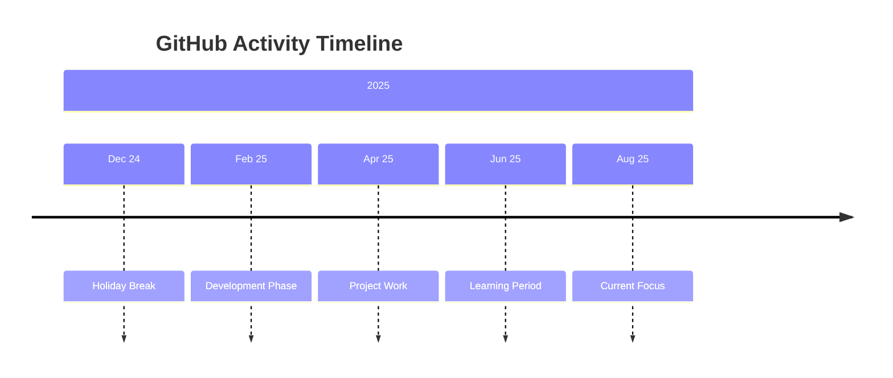

# 💫 GitHub Analytics Dashboard

<div align="center">


</div>

---

## 📊 GitHub Stats

<div align="center">

### **Quick Overview**
```yaml
Username: Eng-MazenEmad
Contributions (2025): 181+
Public Repositories: 4
GitHub Age: 10 months
Email: mazenemad10000@gmail.com
Join Date: 2024
```

</div>

<div align="center" style="display: flex; justify-content: center; gap: 20px; flex-wrap: wrap;">

| Metric | Badge |
|--------|-------|
| **Total Contributions** |  |
| **Public Repositories** |  |
| **GitHub Member Since** |  |
| **Current Streak** |  |

</div>

---

## 🌟 Activity Breakdown

### **📈 Contribution Timeline**


### **💻 Top Languages**
<div align="center">


</div>

---

## 🔗 Connect With Me

<div align="center">

### **📱 Social Media**
[](https://linkedin.com/in/mazen-emad1)
[](https://instagram.com/iammazenemad)
[](https://discord.gg/57wuh2rmrp)
[](https://tiktok.com/@iammazenemad)
[](https://leetcode.com/)

### **📧 Contact**
[](mailto:mazenemad10000@gmail.com)
[](https://wa.me/201146511702)

</div>

---

## 🏆 GitHub Trophies

<div align="center">


</div>

---

## 📅 Contribution Graph

<div align="center">

### **Yearly Activity**


</div>

---

## 📊 Detailed Stats

<div align="center">

| Statistic | Value |
|-----------|-------|
| **Total Stars** |  |
| **Total Forks** |  |
| **Followers** |  |
| **Profile Views** |  |

</div>

---

## 🚀 Recent Activity

<div align="center">

### **Latest Contributions**
<!--START_SECTION:activity-->
```text
📌 Currently working on: Portfolio projects
🎯 Focus Areas: AI/ML, Web Development
📚 Learning: Advanced Algorithms
💡 Next Goal: Contribute to open source
```
<!--END_SECTION:activity-->

</div>

---

## 🎯 Goals for 2025

<div align="center">

```diff
+ Increase GitHub contributions to 500+
+ Build 5+ portfolio projects
+ Learn 3 new technologies
+ Contribute to open source
+ Grow professional network
```

</div>

---

<div align="center">

## 📞 Quick Contact

**Email:** mazenemad10000@gmail.com  
**Phone:** +20 11 4651 1702  
**Location:** Cairo, Egypt  
**Status:** 🟢 Available for collaborations

---

### **📌 Legend**
```diff
+ Green Periods: Active Development
- Red Periods: GitHub Breaks
! Yellow: Learning/Planning Phase
```

</div>

---

<div align="center">

[](https://git.io/typing-svg)

**Last Updated: December 2024**  
**Profile Views:** 

</div>

---

## 🔧 Technical Details

<div align="center">

### **GitHub Stats Cards Used**
```markdown
- github-readme-stats.vercel.app
- github-readme-streak-stats.herokuapp.com
- github-profile-trophy.vercel.app
- github-readme-activity-graph.vercel.app
- shields.io for badges
```

### **Update Frequency**
- Stats update: Every 24 hours
- Graph update: Real-time
- Views counter: Instant

</div>
